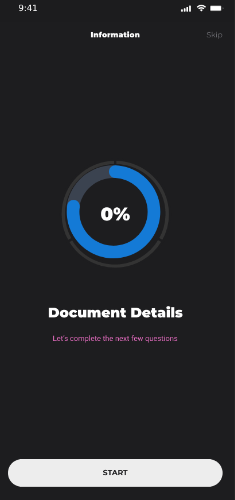
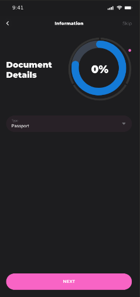
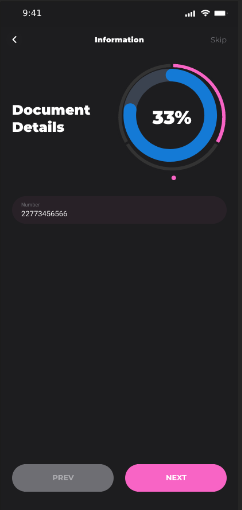
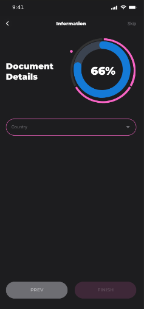

# Document Details App example

## Requirements
- Web Design Rule
 1. Try aiming at a pixel perfect design.
 2. Use the 2 fonts with all its variances accordingly.
 3. Apply all the colours as you see in the design.
 4. Apply the correct spacings & paddings as you see in the design.
 5. Create the components using Styled Components.
 6. Bear in mind that the design follows multiples of 5 and 8.

## Screenshots

    
    
  
  

